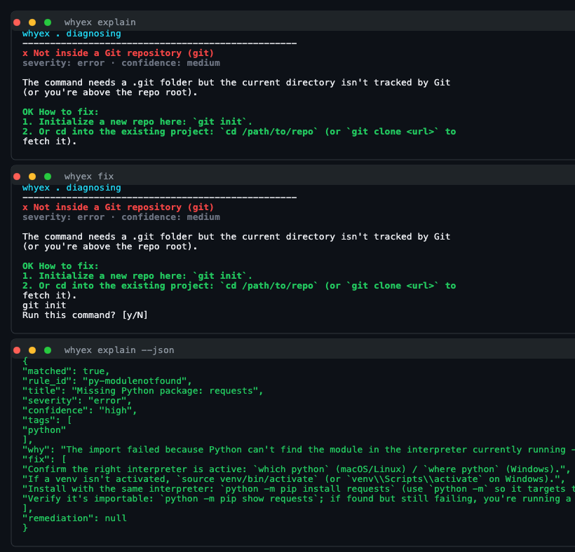

# whyex

**Explain any terminal error offline and show how to fix it.**

`whyex` reads an error from your terminal and tells you, in plain English:

1. what went wrong  
2. why it happened  
3. exact steps to fix it  

No API key. No internet. No AI. Zero dependencies beyond Python itself.

**Author:** [Sai Koushik Yaganti](https://github.com/SAI141003)  
**Repo:** https://github.com/SAI141003/whyex  
**License:** MIT

[](https://github.com/SAI141003/whyex/actions/workflows/ci.yml)
[](LICENSE)
[](https://www.python.org/downloads/)



---

## How to use

### 1. Install

```bash
git clone https://github.com/SAI141003/whyex.git
cd whyex
pip install -e .
```

Check it works:

```bash
whyex --version
```

> After PyPI publish you can also use `pip install whyex` or `pipx install whyex`.

### 2. Explain an error

Paste any error text:

```bash
whyex explain "fatal: not a git repository"
```

```bash
whyex explain "ModuleNotFoundError: No module named 'requests'"
```

### 3. Run a command and auto-explain if it fails

```bash
whyex run npm test
whyex run python app.py
```

### 4. Pipe output from any command

```bash
make 2>&1 | whyex
npm test 2>&1 | whyex
```

### 5. Auto-fix (asks before running anything)

```bash
whyex fix "fatal: not a git repository"
```

`whyex` shows the diagnosis, prints the suggested command (for example `git init`), then asks:

```text
Run this command? [y/N]
```

Use `-y` only if you want to skip the prompt:

```bash
whyex fix -y "fatal: not a git repository"
```

### 6. JSON output (for editors / CI)

```bash
whyex explain --json "ModuleNotFoundError: No module named 'requests'"
```

### 7. See all rules

```bash
whyex list
```

### 8. Optional: shell auto-explain

```bash
whyex init
```

Then in a **new** terminal:

```bash
whyex npm test
```

If the command fails, `whyex` explains it automatically.  
To undo: remove the marked lines from your shell startup file (a `.bak` backup is created).

---

## Quick reference

| Command | What it does |
|---------|----------------|
| `whyex explain "..."` | Explain pasted error text |
| `whyex run <cmd>` | Run a command; explain on failure |
| `cmd 2>&1 \| whyex` | Explain piped stderr/stdout |
| `whyex fix "..."` | Diagnose + offer a safe fix |
| `whyex explain --json "..."` | Machine-readable diagnosis |
| `whyex list` | List all 144 rules |
| `whyex init` | Enable shell auto-explain |

---

## What it covers

**144 rules** across **27 categories**, including:

| Area | Examples |
|------|----------|
| Git | not a repo, push rejected, detached HEAD, SSH issues |
| Python | ModuleNotFoundError, SyntaxError, pip / venv problems |
| Node / npm | missing modules, EACCES, EBADENGINE, network errors |
| Go / Rust / Java / Ruby | missing toolchain, compile / panic / gem errors |
| C / C++ | missing headers, linker errors, segfaults |
| Docker / Kubernetes | daemon down, CrashLoopBackOff, ImagePullBackOff |
| Shell / network / DB | command not found, port in use, SSL, Postgres/Redis |

If nothing matches, `whyex` stays quiet instead of guessing.

---

## How it works

1. **Capture** — from `whyex run`, a pipe, pasted text, or the last failed command  
2. **Match** — against a prioritized rule set (specific patterns beat generic ones)  
3. **Explain** — title, severity, confidence, plain-language cause, numbered fixes  
4. **Fix (optional)** — only trusted remediations, and only after you confirm  

---

## Contribute

Hit an error `whyex` doesn’t know yet?

```bash
whyex contribute \
  --error "WeirdError: boom" \
  --title "Weird Boom" \
  --why "The foo service is down." \
  --fix "restart foo"
```

Then open a PR. Full guide: [CONTRIBUTING.md](CONTRIBUTING.md)

```bash
make test
```

---

## Author

**Sai Koushik Yaganti**  
GitHub: [@SAI141003](https://github.com/SAI141003)  
LinkedIn: [saikoushikyaganti](https://www.linkedin.com/in/saikoushikyaganti/)  
Email: saiyaganti14@gmail.com

---

## License

MIT — see [LICENSE](LICENSE).
